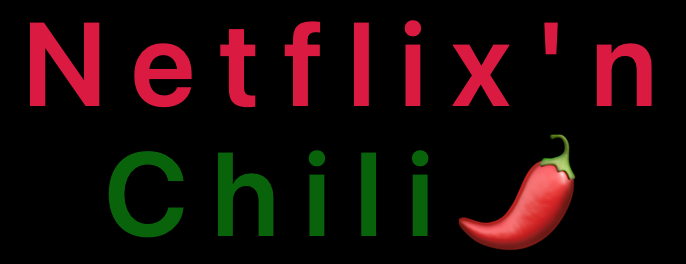

# NetflixnChili
Collaborators: Dani Reinholz, Wesley Bryant, Michelle Wood

Technologies used:
HTML
CSS
Materialize
JavaScript
Lodash
Sweetalert

User Story
1. As a User, I want to search a movie title in Netflix and have it return the Movie Title and Poster image.
2. I also want the movie search to return a random recipe with an image, ingredients, and directions.
3. I would also like a list of past recipes I have searched to use again if I want.
4. This way, I can have a delicious meal to eat while I watch a great movie.

Server-side APIs used:

* https://movie-database-imdb-alternative.p.rapidapi.com/?s=Avengers%20Endgame&r=json&page=1
* https://spoonacular-recipe-food-nutrition-v1.p.rapidapi.com/recipes/479101/information

Link to live site: 
https://reinholz36.github.io/NetflixnChili/

Milestones:
1. Dani established the initial HTML layout and CSS with a nice header, forms, background, and images. He also obtained the Netflix and Spoonacular Recipe API keys and confirmed they responded when the API key was passed through the fetch function.
2. Wesley wrote the initial function to display the movie title.
3. During a group Zoom, Dani and Wesley were able get  to the movie poster display as well.
4. With the group, Michelle found an attribute to hide the recipe link then show it when a movie search result was returned along with a recipe.
5. Dani made a bonus feature of having Admin picks presented on the site.

Challenges:
1. Git issues such as untracked branches and merge conflicts. Usually we were able to resolve them within VS code by accepting the current or incoming changes.
2. Getting the past recipe list proved difficult. Wesley and Dani met on Zoom to fix it.

Slides Deck:
https://uncvirtbofsfpt112021.slack.com/archives/C02RASPDFED/p1641227254003500

